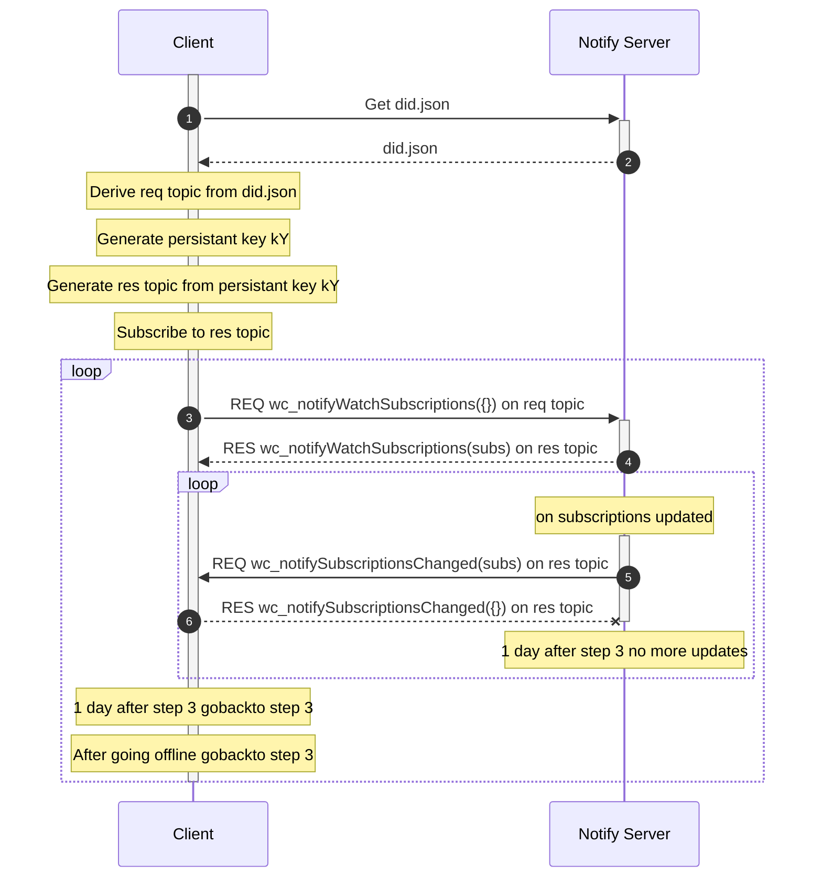
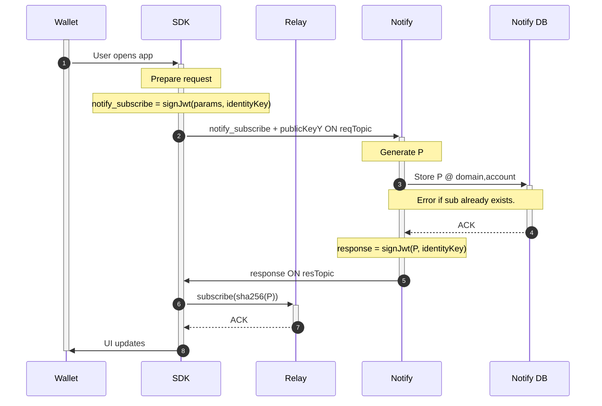
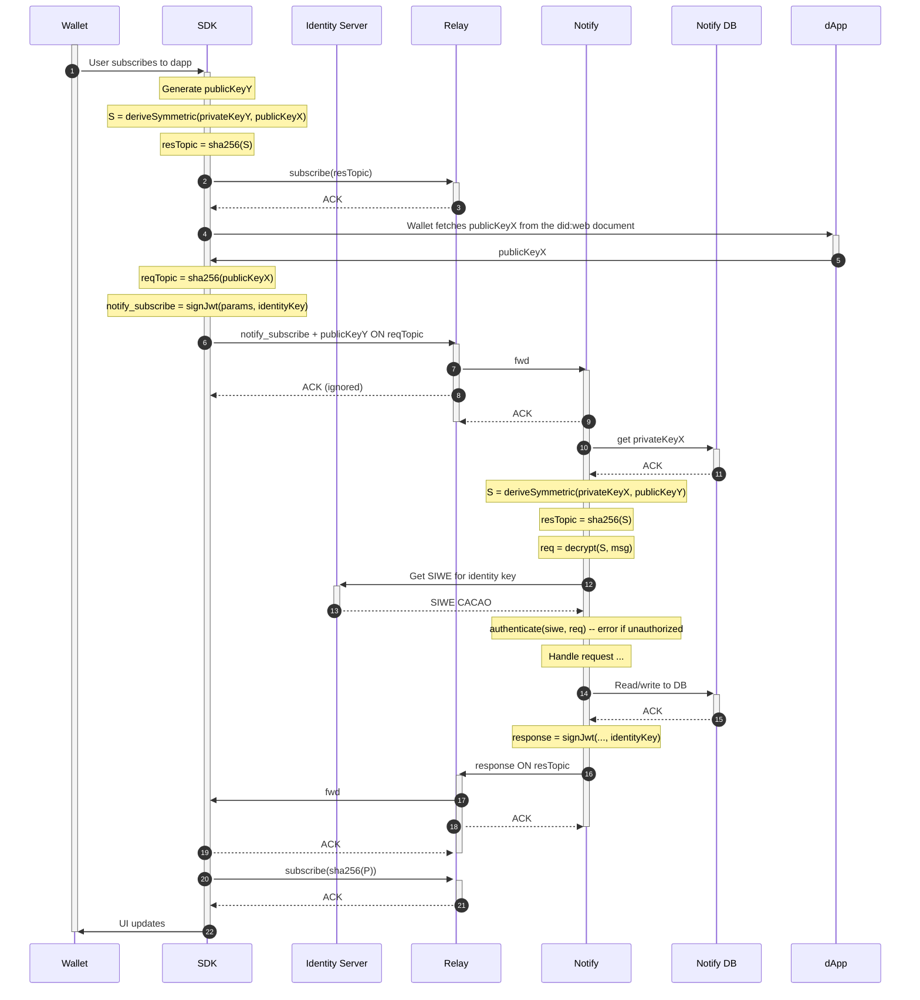

# RPC Methods

Methods can be called after the client [registers an Identity Key](../../servers/keys/identity-keys.md#key-registration).

All methods contain an "auth" field in the `params` (for request) or `result` (for response) which is a signed JWT. JWTs are specified in the [authentication](./notify-authentication.md) document.

All methods follow the [JSON-RPC 2.0 spec](https://www.jsonrpc.org/specification).

## Getting & watching subscriptions



Notes:
- Each client will call `wc_notifyWatchSubscriptions` separately with separate persistent keys kY
- Recommended: persist kY to avoid multiple unnecessary response topics
- `subs` contains the full subscription state, not delta or transactional differences
- `wc_notifyWatchSubscription` response and `wc_notifySubscriptionsChanged` request messages expires after 5 minutes to reduce mailbox load and these updates are ephemeral anyway
  - If client goes offline for 5 minutes it must call `wc_notifyWatchSubscriptions` again to continue receiving updates
- Notify server will no longer send updates after 1 day of not calling `wc_notifyWatchSubscription`
  - Client must call `wc_notifyWatchSubscriptions` at least once a day to continue receiving updates

### wc_notifyWatchSubscriptions

Used to get the list of subscriptions for an account, and watch for updates.

**Request**

```jsonc
{
  "watchSubscriptionsAuth": string
}

| IRN     |          |
| ------- | -------- | 
| TTL     | 30       |
| Tag     | 4010     |
```

Topic: hash of key agreement public key from [Notify Server Authentication](./notify-server-authentication.md)

Message uses type 1 envelope with the client's persistant private key

**Response**

```jsonc
{
  "responseAuth": string
}

| IRN     |          |
| ------- | -------- |
| TTL     | 300      |
| Tag     | 4011     |
```

Topic: hash of symmetric key derivation of client's persistant private key and key agreement public key from [Notify Server Authentication](./notify-server-authentication.md)

### wc_notifySubscriptionsChanged

Used to indicate a change to subscriptions has occurred.

**Request**

```jsonc
{
  "subscriptionsChangedAuth": string
}

| IRN     |          |
| ------- | -------- | 
| TTL     | 300      |
| Tag     | 4012     |
```

Topic: same as wc_notifyWatchSubscriptions response

**Response**

```jsonc
{
  "responseAuth": string
}

| IRN     |          |
| ------- | -------- |
| TTL     | 300      |
| Tag     | 4013     |
```

Topic: same as wc_notifyWatchSubscriptions response

## wc_notifySubscribe

Used to subscribe notify subscription to a peer through subscribe topic. Response is expected on the response topic.

**Request**

```jsonc
{
  "subscriptionAuth": string
}

| IRN     |          |
| ------- | -------- | 
| TTL     | 30       |
| Tag     | 4000     |
```

Topic: notify topic

**Response**

```jsonc
{
  "responseAuth": string
}

| IRN     |          |
| ------- | -------- |
| TTL     | 2592000  |
| Tag     | 4001     |
```

Topic: notify topic



## Detailed request & response pattern

This is used by `wc_notifyWatchSubscriptions` and `wc_notifySubscribe`



## wc_notifyMessage

Used to publish a notification message to a peer through notify topic. Response is expected on the same topic.

**Request**

```jsonc
{
  "messageAuth": string
}

| IRN     |          |
| ------- | -------- |
| TTL     | 2592000  |
| Tag     | 4002     |
```

Topic: notify topic

**Response**

```jsonc
{
  "receiptAuth": string
}

| IRN     |          |
| ------- | -------- |
| TTL     | 2592000  |
| Tag     | 4003     |
```

Topic: notify topic

## wc_notifyUpdate

Used to update a notify subscription with a new notify subscription, replacing an existing notify subscription through notify topic.

**Note:** this method is atomically performing two methods (wc_notifyDelete + wc_notifySubscribe)

**Request**

```jsonc
{
  "updateAuth": string
}

| IRN     |          |
| ------- | -------- | 
| TTL     | 30       |
| Tag     | 4008     |
```

Topic: notify topic

**Response**

```jsonc
{
  "responseAuth": string
}

| IRN     |          |
| ------- | -------- |
| TTL     | 2592000  |
| Tag     | 4009     |
```

Topic: notify topic

## wc_notifyDelete

Used to inform the peer to close and delete a notify subscription through notify topic. The reason field should be a human-readable message defined by the SDK consumer to be shown on the peer's side.

**Request**

```jsonc
{
  "deleteAuth": string 
}

| IRN     |          |
| ------- | -------- |
| TTL     | 2592000  |
| Tag     | 4004     |
```

Topic: notify topic

**Response**

```jsonc
{
  "responseAuth": string
}

| IRN     |          |
| ------- | -------- |
| TTL     | 2592000  |
| Tag     | 4005     |
```

Topic: notify topic
