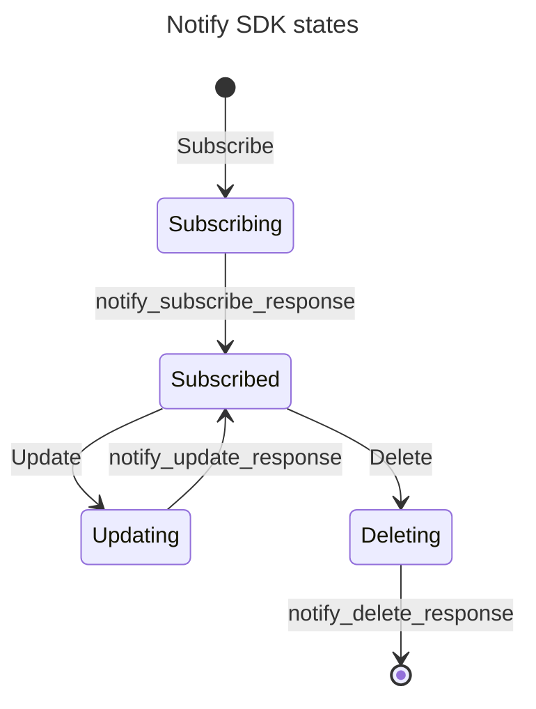
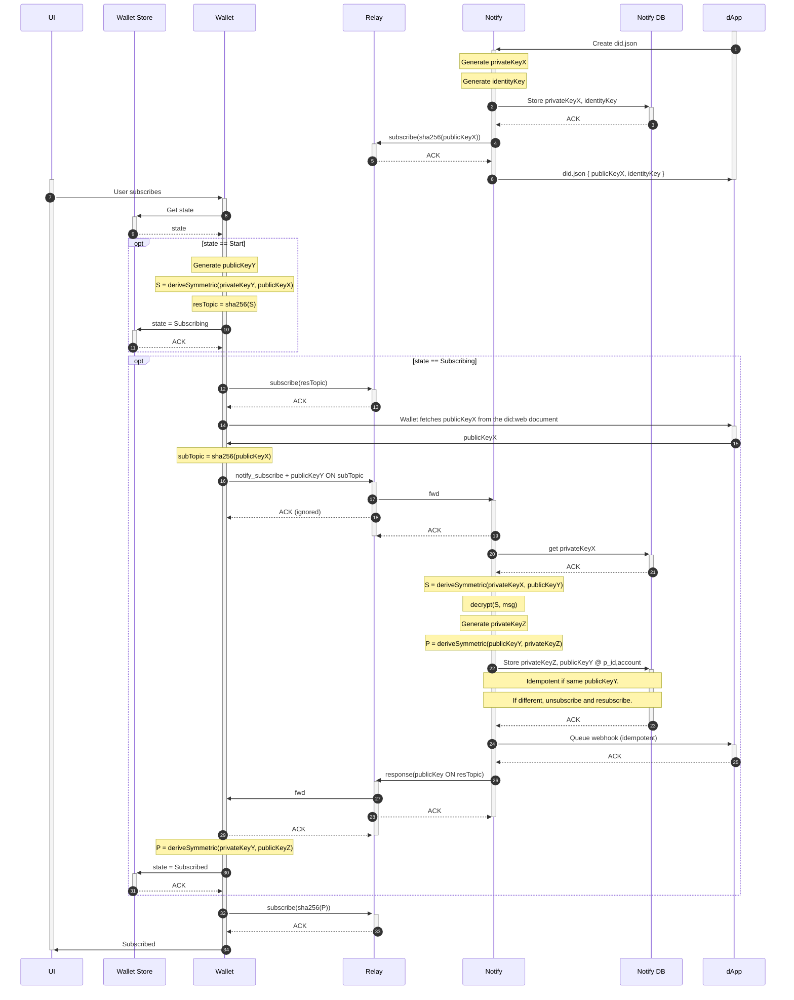

## State machine

```mermaid
---
title: Notify SDK states
---
stateDiagram-v2
    Sing: Subscribing
    S: Subscribed
    Uing: Updating
    Ding: Deleting
    [*] --> Sing: Subscribe
    Sing --> S: notify_subscribe_response
    %% Sing --> Ding: Delete
    S --> Uing: Update
    Uing --> S: notify_update_response
    %% Uing --> Ding: Delete
    S --> Ding: Delete
    Ding --> [*]: notify_delete_response
```

## Sequence diagram

```mermaid
sequenceDiagram
    autonumber
    participant U AS UI
    participant S AS Wallet Store
    participant W AS Wallet
    participant R as Relay
    participant N AS Notify
    participant D as Notify DB
    participant A as dApp

    %% Subscribe Topic
    activate A
    A->>+N: Create did.json
    Note over N: Generate privateKeyX
    Note over N: Generate identityKey
    N->>+D: Store privateKeyX, identityKey
    D-->>-N: ACK
    N->>+R: subscribe(sha256(publicKeyX))
    R-->>-N: ACK
    N->>-A: did.json { publicKeyX, identityKey }
    deactivate A

    %% Subscribe
    activate U
    U->>+W: User subscribes
    W->>+S: Get state
    S-->>-W: state
    opt state == Start
        Note over W: Generate publicKeyY
        Note over W: S = deriveSymmetric(privateKeyY, publicKeyX)
        Note over W: resTopic = sha256(S)
        W->>+S: state = Subscribing
        S-->>-W: ACK
    end
    opt state == Subscribing
        W->>+R: subscribe(resTopic)
        R-->>-W: ACK
        W->>+A: Wallet fetches publicKeyX from the did:web document
        A->>-W: publicKeyX
        Note over W: subTopic = sha256(publicKeyX)
        W->>R: notify_subscribe + publicKeyY ON subTopic
        activate R
        R->>N: fwd
        activate N
        R-->>W: ACK (ignored)
        N-->>R: ACK
        deactivate R
        N->>+D: get privateKeyX
        D-->>-N: ACK
        Note over N: S = deriveSymmetric(privateKeyX, publicKeyY)
        Note over N: decrypt(S, msg)
        Note over N: Generate privateKeyZ
        Note over N: P = deriveSymmetric(publicKeyY, privateKeyZ)
        N->>+D: Store privateKeyZ, publicKeyY @ p_id,account
        Note over N,D: Idempotent if same publicKeyY.
        Note over N,D: If different, unsubscribe and resubscribe.
        D-->>-N: ACK
        N->>+A: Queue webhook (idempotent)
        A-->>-N: ACK
        N->>+R: response(publicKey ON resTopic)
        activate R
        R->>W: fwd
        R-->>N: ACK
        deactivate N
        W-->>R: ACK
        deactivate R
        Note over W: P = deriveSymmetric(privateKeyY, publicKeyZ)
        W->>+S: state = Subscribed
        S-->>-W: ACK
    end
    W->>+R: subscribe(sha256(P))
    R-->>-W: ACK
    W->>-U: Subscribed
    deactivate U
```