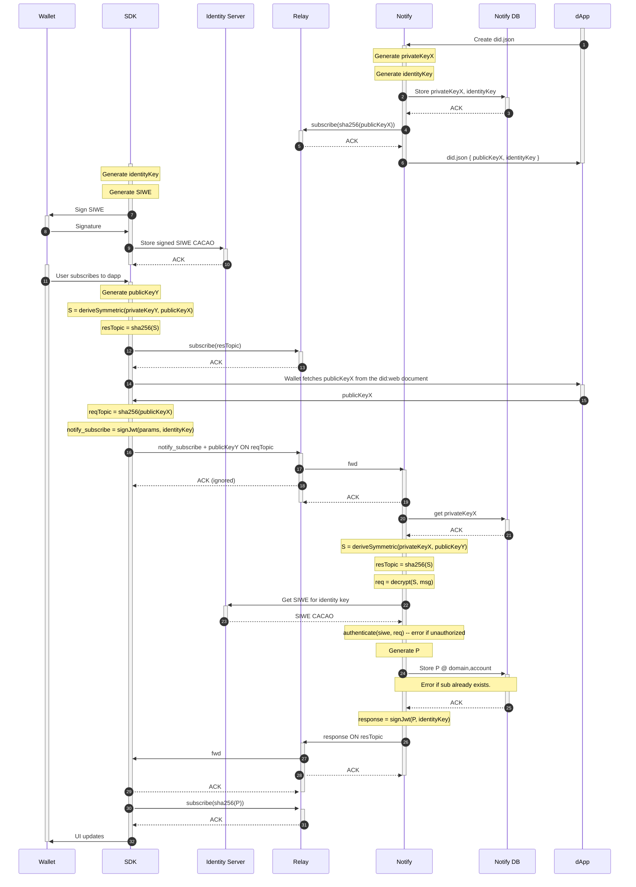
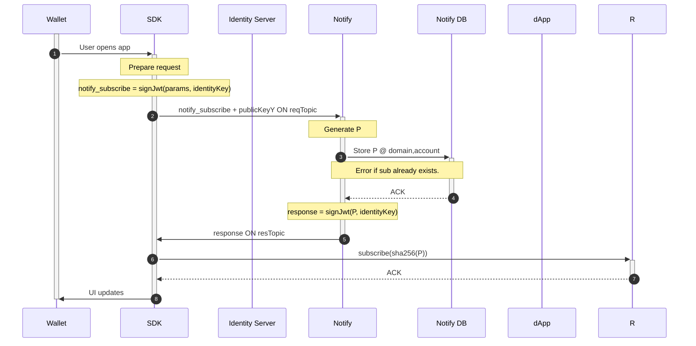
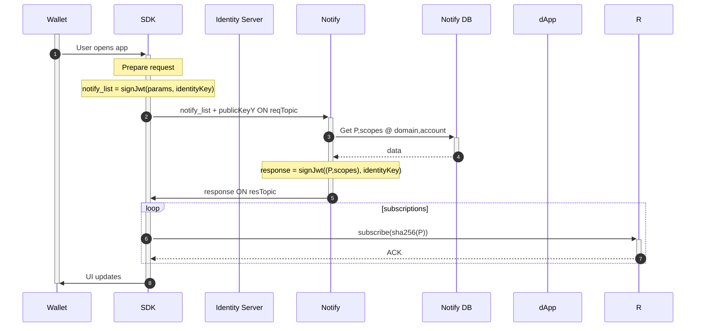
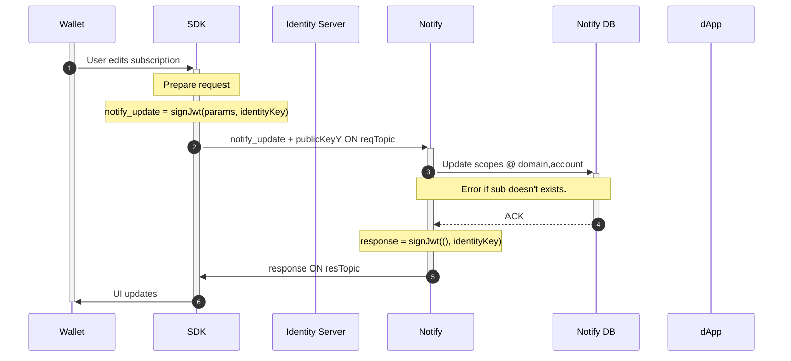
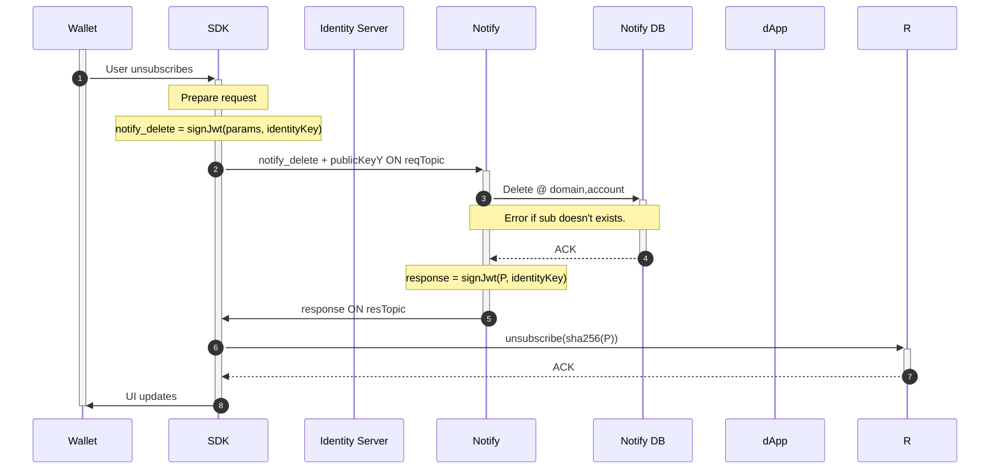

## Request/response pattern

This is used for all CRUD actions including:

- Get subscriptions (including notification symkey)
  - If limited access, only give for domain
  - If unlimited access, give all subscriptions
- Create subscription
- Update subscription
- Delete subscription

It involves using a public request topic to send the message, and a generated response topic unique per caller.

The third topic notify uses is the notification topic for sending notifications exclusively, and this topic is retrieved via "List subscriptions` above.

"Prepare request" in subsequent diagrams include all steps prior to signing the JWT.

"Authenticate request" in subsequent diagrams include all steps in notify after receiving the message, until authenication.

## Create subscription

## List subscriptions

## Update subscription

## Delete subscription

