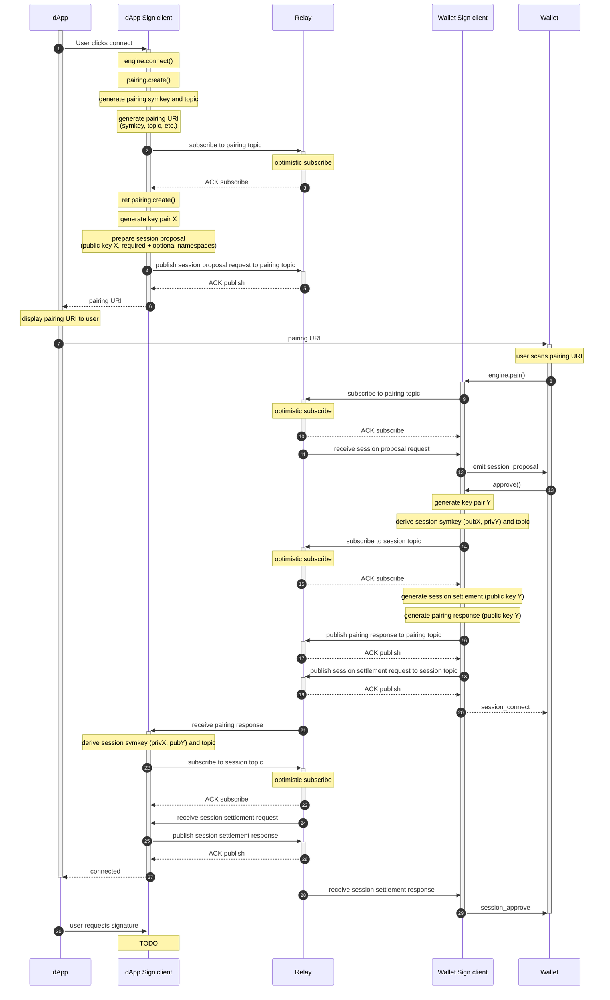
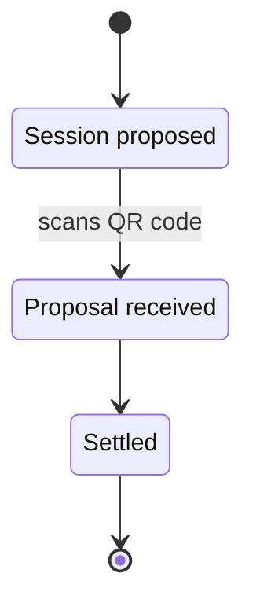

# Session Proposal

## User Flow

User visits application that requires to connect wallet

1. App displays qrcode or deep link to connect wallet
2. User scans qrcode or redirects to wallet
3. User approves session proposal from App
4. User returns to app after success prompt
5. App receives accounts and namespaces from Wallet
6. App sends request to sign transaction or message
7. User redirects to wallet to inspect request
8. User approves transaction or message request
9. User returns to app after success prompt
10. App receives transaction confirmation or signature

## Proposal Protocol

#### Prerequisites
Wallet and Dapp are required to establish pairing P before proceeding to Sign protocol execution.

#### Protocol

Proposal protocol will be established as follows:

1. Dapp sends session proposal on pairing P with publicKey, relay, permissions and metadata
2. Wallet receives session proposal with required namespaces and public key X on pairing P
3. Wallet generates key pair Y
4. Wallet settles session with symmetric key derived with keys X and Y
5. Session topic B key is derived from sha256 hash of session's symmetric key 
6. In parallel:
  * Wallet sends settlement payload to topic B with metadata, namespaces and public key Y
  * Wallet sends proposal response on pairing P with publicKey Y 
7. Dapp receives propose response on pairing P
8. Dapp settles session with topic B using derived key
9. Dapp receives settlement on topic B
10. Dapp sends acknowledgment on topic B

Note: numbers below are different from above

