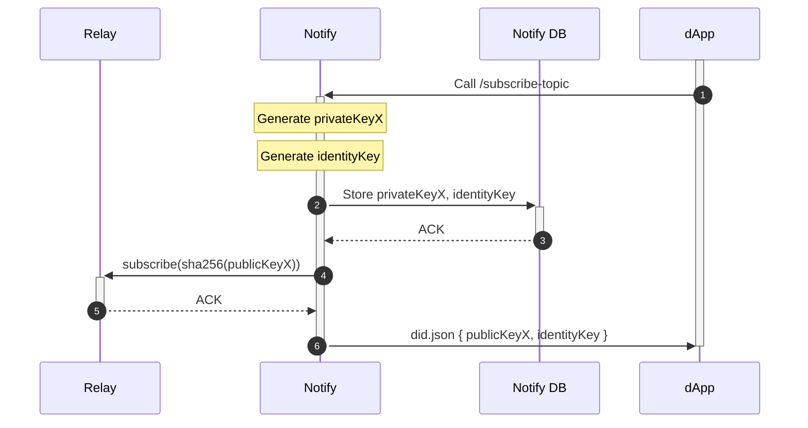

# Notify Server API

## Authentication

All endpoints expect an `Authorization` header in the form `Authorization: Bearer <notify_api_secret>` using the notify_api_secret associated with a project ID. The secret used should be the one that was generated automatically when configuring notify - with the name `notify_api_secret`.

## Notify

Send notifications to accounts.

`POST /v1/notify`

Body:

```typescript
[{
  idempotencyKey?: string | null,
  notification: {
    type: string,
    title: string,
    body: string,
    icon?: string | null,
    url?: string | null,
  },
  accounts: AccountId[],
}]
```

```typescript
// CAIP-10 account ID
type AccountId = string
```

Response:

TODO change to respond with list of created notification UUIDs
TODO separate endpoint to get the status of a notifcation UUID

```typescript
{
  "sent": AccountId[], // notifications sent to subscribers
  "failed": Failed[], // notifications not sent because there was a failure in delivering
  "notFound": AccountId[], // notifications not sent becuase those accounts were not subscribers
}
```

Failed:

```typescript
{
  "account": AccountId,
  "reason": string,
}
```

## Subscribers 

Get the list of all accounts currently subscribed to this app.

`GET /v1/subscribers`

Response:

```typescript
AccountId[]
```

## Webhooks

Webhooks can be registered so your app can receive an HTTP request whenver an account subscribes or unsubscribes to notifications.

### Webhook request

`POST <URL>`

```typescript
type Body = {
  // JSON WebhookPayload
  payload: string,
  // HMAC signature of `payload` equivilent to Stripe's verification logic: https://stripe.com/docs/webhooks#verify-manually
  signature: string,
}

type WebhookPayload = {
  // ID of the webhook that this request is for
  webhookId: string,
  // Unique ID of the event to deduplicate requests that were retried
  idempotencyKey: string,
  event: Event,
  account: AccountId,
}

type Event = "subscribed" | "unsubscribed";
```

URL must return a 2xx status code, or the webhook request will be retried for 7 days with exponential backoff. Response body is ignored.

The payload 

### Register Webhook

Register a webhook that will be invoked when accounts are subscribed or unsubscribed.

`POST /v1/webhooks`

Body: `Webhook`

```typescript
type Webhook = {
  // Which events to listen for
  events: Event[],
  // Webhook endpoint to send events to.
  url: string,
}
```

```typescript
type Response = {
  // Webhook ID
  id: string,
  // Shared secret for authenticating webhook requests
  secret: string,
}
```

### Registered Webhooks

Get the list of registered webhooks.

`GET /v1/webhooks`

```typescript
type Response = {
  "<webhook_id1>": WebhookResponse,
  "<webhook_id2>": WebhookResponse,
  ...
}

type WebhookResponse = Webhook & {
  // Shared secret for authenticating webhook requests
  secret: string,
}
```

### Update Webhook

Update a webhook.

`PUT /v1/webhooks/<webhook_id>`

Body: `Webhook`

No response.

### Rotate Webhook Shared Secret

Update a webhook.

`POST /v1/webhooks/<webhook_id>/secret`

No body.

```typescript
type Response = {
  // New shared secret for authenticating webhook requests. Old secret will continue to sign webhooks for for 24 hours.
  secret: string,
}
```

### Delete Webhook

Delete a webhook.

This method is idempotent. If webhook ID does not exist, the request will still be successful.

`DELETE /v1/webhooks/<webhook_id>`

No response.

## Subscribe Topic

Used to generate a subscribe topic for an app to receive subscription requests from an account. Returns keys that should be stored on apps's domain a did:web document.

**Note:** this method is idempotent and will always return the same key.

`POST /v1/subscribe-topic`

```typescript
type Body = {
  appDomain: string,
}
``` 

```typescript
type Response = {
  subscribeKey: string,
  authenticationKey: string,
}
```


