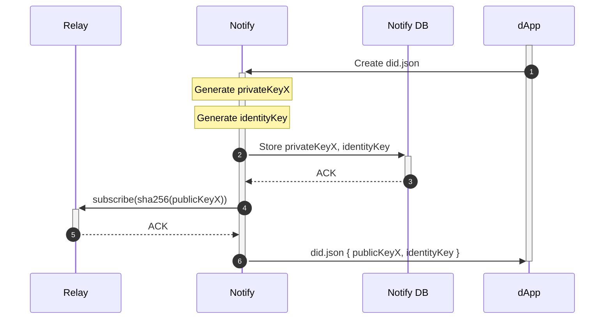

# Notify Server API

## Authentication

All endpoints expect an `Authorization` header in the form `Authorization: Bearer <project_secret>` using the project secret associated with a project ID. The secret used should be the one that was generated automatically when configuring notify - with the name `notify_subscribe_topic_private_key`.

## Notify

Send a notification to a set of accounts.

`POST /notify`

Body:

```typescript
{
  "notification": {
    "title": string,
    "body": string,
    "icon": string,
    "url": string,
    "type": string,
  },
  "accounts": Account[],
}
```

Account:

```typescript
string
```

Response: 

```typescript
{
  "sent": Account[], // notifications sent to subscribers
  "failed": Failed[], // notifications not sent because there was a failure in delivering
  "notFound": Account[], // notifications not sent becuase those accounts were not subscribers
}
```

Failed:

```typescript
{
  "account": Account,
  "reason": string,
}
```

## Subscribers 

Get the list of all accounts currently subscribed to this dapp.

`GET /subscribers`

Response:

```typescript
Account[]
``` 

## Subscribe Topic

Used to generate a subscribe topic for a dapp to receive subscription requests from an account. Returns keys that should be stored on dapps's domain a did:web document.

**Note:** this method is idempotent and will always return the same key.

`POST /subscribe-topic`

Body:

```typescript
{
  "dappUrl": string,
}
``` 

Response:

```typescript
{
  "subscribeTopicPublicKey": string, // key agreement
  "identityPublicKey": string, // authentication
}
```



## Register Webhook

Register a webhook that will be invoked when accounts are subscribed or unsubscribed.

`POST /register-webhook`

Body:

```typescript
Webhook
```

Webhook:

```typescript
{
  "events": Event[], // set of Events
  "url": string, // webhook URL
}
```

Event:

```typescript
"subscribed" | "unsubscribed"
```

Response:

```typescript
{
  "id": string, // webhook ID
}
```

## Registered Webhooks

Get the list of registered webhooks.

`GET /webhooks`

Response:

```typescript
{
  "<webhook_id1>": Webhook,
  "<webhook_id2>": Webhook,
  ...
}
```

## Update Webhook

Update a webhook.

`PUT /webhooks/<webhook_id>`

Body:

```typescript
Webhook
```

No response.

## Delete Webhook

Delete a webhook.

This method is idempotent. If webhook ID does not exist, the request will still be successful.

`DELETE /webhooks/<webhook_id>`

No response.
