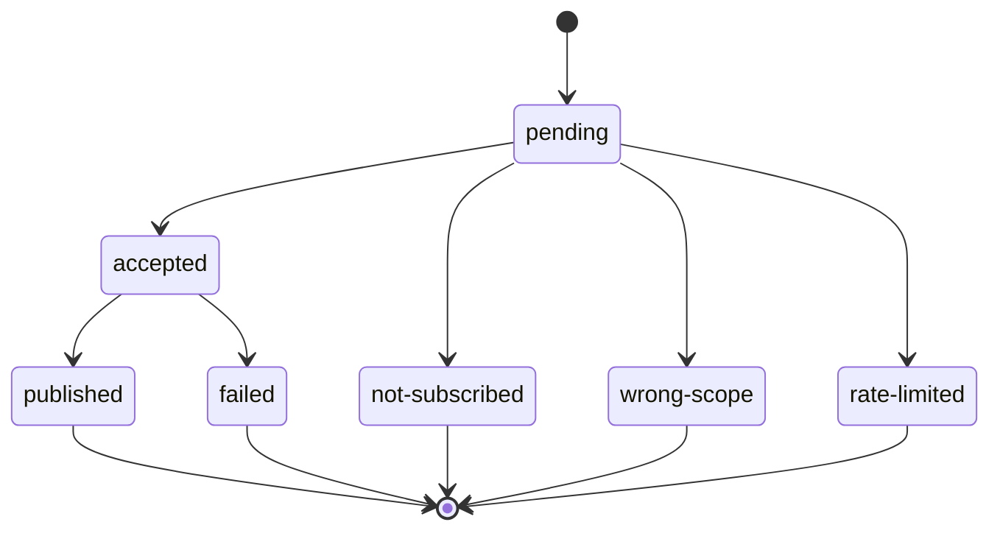
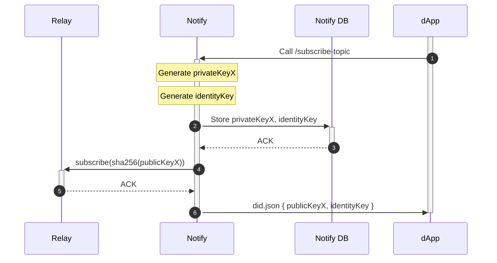

# Notify Server API

## Authentication

All endpoints expect an `Authorization` header in the form `Authorization: Bearer <notify_api_secret>` using the notify_api_secret associated with a project ID. The secret used should be the one that was generated automatically when configuring notify - with the name `notify_api_secret`.

## Send Notifications

Send 1 or more notifications to accounts. Notifications handled itempotently are deduplicated by `notificationId`.

`POST /v1/<project-id>/notify`

```typescript
type Body = [{
  // Idempotency key and ID to track status. Max 255 characters.
  notificationId?: string | null,
  notification: {
    // The notification type ID found in [Notify Config](../../clients/notify/notify-config.md)
    type: Uuid,
    // The title of the notification. Max 64 characters.
    title: string,
    // The body of the notification. Max 255 characters.
    body: string,
    // URL for the icon of the notification. Max 255 characters.
    icon?: string | null,
    // URL for the notification. Max 255 characters.
    url?: string | null,
  },
  // The accounts to send this notification to. If null or undefined, all accounts subscribed to the notification type will be sent the notification.
  accounts?: AccountId[] | null,
}]
```

```typescript
// CAIP-10 account ID
type AccountId = string
```

```typescript
type Response = {
  // IDs for the sent notifications returned in the same order as the body. If a `notificationId` wasn't specified in the request, one will be generated.
  notifications: string[],
}
```

## Notification Status

Get a sent notification and the number of accounts with each status.

`GET /v1/<project-id>/notification/<notification-id>`

```typescript
type Response = SentNotification
```

```typescript
type SentNotification = {
  id: string,
  sentAt: timestamp,
  type: Uuid,
  title: string,
  body: string,
  icon: string | null,
  url: string | null,
  statuses: {
    [status: Status]: number,
  },
}
```

```typescript
// The status of the notification. Client must be forwards-compatible with new statuses.
type Status = 
  // Determining initial status
  "pending" |
  // Accepted to be published
  "accepted" |
  // Published successfully to subscribers
  "published" |
  // Not published becuase those accounts were not subscribers
  "not-subscribed" |
  // Not published becuase while those accounts were subscribers, they were not subscribed to the sent notification type
  "wrong-scope" |
  // Not published because the account's rate limit was hit
  "rate-limited" |
  // Failed to publish to relay after repeated retries
  "failed"
```



You can also get the status per-account:

`GET /v1/<project-id>/notification/<notification-id>/account`

- `?limit=number` - Maximum number of entries to return, default 10, max 1000
- `?starting_after=AccountId` - AccountId of the last account

```typescript
type Response = {
  hasMore: boolean,
  data: {
    account: AccountId,
    status: Status,
  }[],
}
```

You can also get the notification status for a specific account.

`GET /v1/<project-id>/notification/<notification-id>/account/<account-id>`

```typescript
type Response = {
  status: Status,
}
```

## Notification History

Get notification history, starting with the most recently sent notifications.

`GET /v1/<project-id>/notification`

- `?type=<notification-type>[,<notification-type>]` - Only return notifications with one of these notification types
- `?limit=number` - Maximum number of entries to return, default 10, maximum 100
- `?starting_after=string` - ID of the last notification

```typescript
type Response = {
  hasMore: boolean,
  data: SentNotification[],
}
```

## Subscribers 

Get the list of all accounts currently subscribed to this app.

`GET /v1/<project-id>/subscribers`

- `?scope=<notification-type>[,<notification-type>]` - Only return subscribers that are subscribed to 1 or more of these notification types
- `?limit=number` - Maximum number of entries to return, default 10, max 1000
- `?starting_after=AccountId` - AccountId of the last subscriber

```typescript
type Response = {
  hasMore: boolean,
  data: {
    account: AccountId,
    // Notification types subscribed to
    scope: Uuid[],
  }[],
}
```

## Webhooks

Webhooks can be registered so your app can receive an HTTP request whenver an account subscribes or unsubscribes to notifications.

### Webhook Request

`POST <url>`

```typescript
type Body = {
  // JSON WebhookPayload
  payload: string,
  // HMAC signature of `payload` equivilent to Stripe's verification logic: https://stripe.com/docs/webhooks#verify-manually
  signature: string,
}

type WebhookPayload = {
  // ID of the webhook that this request is for
  webhookId: string,
  // Unique ID of the event to deduplicate requests that were retried
  idempotencyKey: string,
} & ({
  event: "subscriber-subscribed" | "subscriber-updated",
  // The account that triggered the event
  account: AccountId,
  // The new set of notification types of the account's subscription
  scope: string[],
} | {
  event: "subscriber-unsubscribed",
  // The account that triggered the event
  account: AccountId,
} | {
  // TODO wip
  event: "notification-sent",
  // The notification that was sent
  notification: string,
} & {
  // TODO wip
  event: "notification-delivered",
  // The ID of the notification that was sent
  notification: string,
  // The account that the notification was delivered to
  account: AccountId,
})
```

URL must return a 2xx status code, or the webhook request will be retried for 7 days with exponential backoff. Response body is ignored.

### Register Webhook

Register a webhook that will be invoked when accounts subscribe to notifications, update their notification subscription, or unsubscribe.

Each project is limited to a maximum of 5 webhooks.

`POST /v1/<project-id>/webhooks`

```typescript
type Body = {
  // Which events to listen for
  events: Event[],
  // HTTP endpoint to send Webhook Requests to
  url: string,
}
```

```typescript
type Response = {
  // Webhook ID
  id: string,
  // Shared secret for authenticating Webhook Requests
  secret: string,
}
```

### Registered Webhooks

Get the list of registered webhooks.

`GET /v1/<project-id>/webhooks`

```typescript
type Response = {
  webhooks: (Webhook & {
    // Webhook ID
    id: string,
    // Shared secret for authenticating Webhook Requests
    secret: string,
  })[],
}
```

### Update Webhook

Update a webhook.

`PUT /v1/<project-id>/webhooks/<webhook-id>`

```typescript
type Body = {
  // Which events to listen for
  events: Event[],
  // HTTP endpoint to send Webhooks Requests to
  url: string,
}
```

No response.

### Rotate Webhook Shared Secret

Rotates the shared secret and returns the new secret to be installed on the endpoint. The old secret will continue to sign webhooks for for 24 hours, in addition to the new one.

`POST /v1/<project-id>/webhooks/<webhook-id>/secret`

No body.

```typescript
type Response = {
  // New shared secret for authenticating Webhook Requests
  secret: string,
}
```

### Delete Webhook

Delete a webhook.

This method is idempotent. If webhook ID does not exist, the request will still be successful.

`DELETE /v1/<project-id>/webhooks/<webhook-id>`

No response.

## Subscribe Topic

Used to generate a subscribe topic for an app to receive subscription requests from an account. Returns keys that should be stored on apps's domain a did:web document.

**Note:** this method is idempotent and will always return the same key.

`POST /v1/<project-id>/subscribe-topic`

```typescript
type Body = {
  appDomain: string,
}
``` 

```typescript
type Response = {
  subscribeKey: string,
  authenticationKey: string,
}
```


